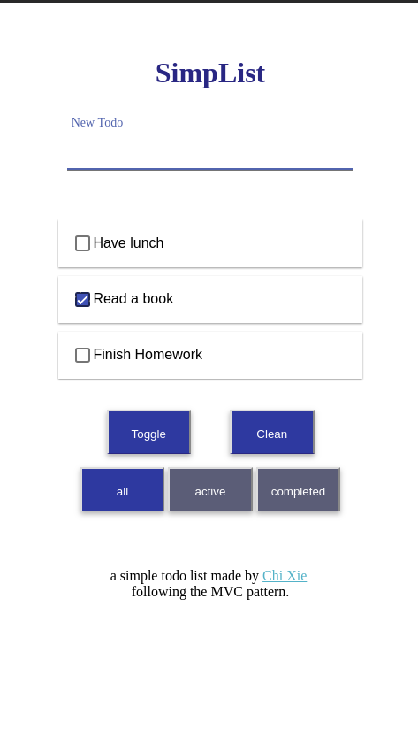

# SimpList

A web-based todo MVC implementation, with vanilla JavaScript and CSS.

## Compatibility

Tested on iPhone and ipad (chrome and safari), and the result was pretty good. 

Note that it can not run on PC browser because I use the event of touch, which is only supported on mobile devices.

## Functions & Features

### Basic

#### Add

1. input the information of 1 new item and add it to the list (by return)

#### List

1. list items

#### Delete

1. delete one item (by swipe left)
2. delete all completed items at one time

#### Update

1. complete one item
2. complete all items or set all to unfinished status

#### Local Storage

1. use localStorage to keep the data

### High-level

1. edit the information of an item (by swipe right)
2. filtered the items showing in the list by conditions like 'all/active/completed'

