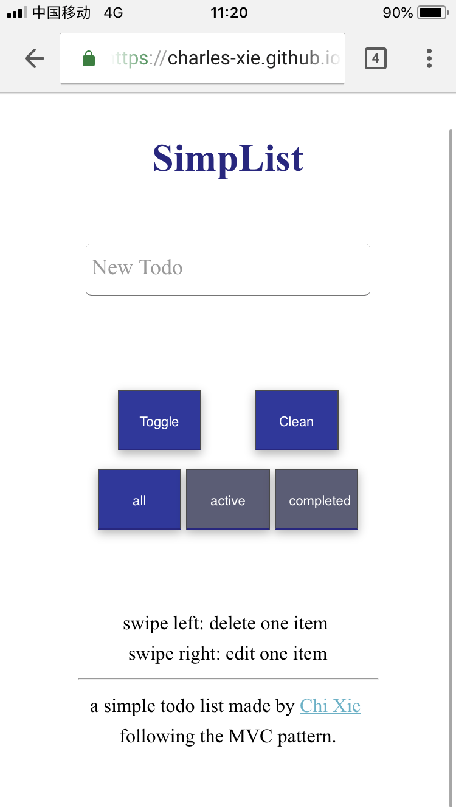

# SimpList

A web-based todo MVC implementation, with vanilla JavaScript and CSS.


## Compatibility

Tested on iPhone and ipad (chrome and safari), and the result was pretty good. 

Note that it can not run on PC browser because I use the event of touch, which is only supported on mobile devices.


## Functions & Features

### Basic

#### Add

1. input the information of 1 new item and add it to the list (by return)

#### List

1. list items

#### Delete

1. delete one item (by swipe left)
2. delete all completed items at one time

#### Update

1. complete one item
2. complete all items or set all to unfinished status

#### Local Storage

1. use localStorage to keep the data

### High-level

1. edit the information of an item (by swipe right)
2. filtered the items showing in the list by conditions like 'all/active/completed'

## Idea & Code

### Idea

1. Seperation of Model, View and Controller
2. Instead of updating view according to the model using a render function, I made controller the center, and for each operation, the controller will send command to both view and controller, and update on these two aspects seperately. 

### Program Structure

```
.
├── css
│   └── style.css
├── img
│   └── screenshot.png
├── index.html
├── js
│   ├── app.js
│   └── utils.js
├── package.json
└── README.md

app.js --> TodoMVC  --> TodoView    ------|
                    --> TodoModel   ------|
                    --> TodoController <--|

```


## How-to

### How to Run

Simply download the file and open it in the browser, and turn on the mobile mode of chrome DevTool.

To view it on your mobile device, like iPhone, you can run this:

```shell
npm install serve -g 
serve ./
```

The ip address and port will be shown.

## Highlights

More appropriately to be called "selling and boasting"

### Simple, Mobile Style



### CSS Animation for Detail

But still not enough :3

### Just CSS and JS

No framework or third-party library used. Good practice :3
